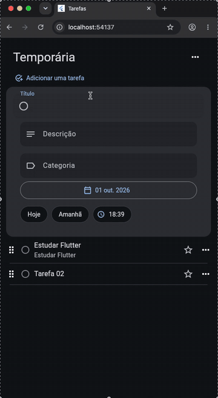

# Todo

Aplicativo de gerenciamento de tarefas desenvolvido em Flutter. A interface usa
Material Design 3, adapta-se a diferentes tamanhos de tela e acompanha o tema
claro ou escuro configurado no sistema.

## Demonstração

<p align="center">
  
</p>

> Para assistir à gravação com qualidade original e áudio, acesse
> [assets/apresentacao.mov](assets/apresentacao.mov).

## Funcionalidades

- criação e edição de tarefas diretamente na lista;
- título, descrição, categoria, data e horário de vencimento;
- atalhos para definir o vencimento como hoje ou amanhã;
- conclusão, reabertura, exclusão e marcação de tarefas como favoritas;
- reordenação por arrastar e soltar;
- ações em lote para concluir todas ou excluir as concluídas;
- confirmação antes de exclusões e feedback por mensagens;
- estado vazio, layout responsivo e temas claro e escuro;
- interface e seletores de data/hora localizados em português do Brasil.

As tarefas são mantidas em memória nesta versão. Portanto, os dados voltam ao
estado inicial quando o aplicativo é reiniciado.

## Tecnologias

- [Flutter](https://flutter.dev/) e Dart;
- Material Design 3;
- [Provider](https://pub.dev/packages/provider) para gerenciamento de estado;
- `flutter_localizations` para localização em português;
- testes unitários, de widgets e golden tests.

## Como executar

### Pré-requisitos

- Flutter SDK com suporte ao Dart `3.12.2` ou superior;
- um navegador, emulador ou dispositivo configurado para Flutter.

Confira se o ambiente está pronto:

```bash
flutter doctor
```

Instale as dependências:

```bash
flutter pub get
```

Execute o aplicativo no dispositivo disponível:

```bash
flutter run
```

Para executar especificamente no navegador:

```bash
flutter run -d chrome
```

## Testes e qualidade

Execute toda a suíte de testes:

```bash
flutter test
```

Verifique a análise estática do projeto:

```bash
flutter analyze
```

Os testes cobrem as operações do `TaskViewModel`, os principais fluxos da
interface, a responsividade em tamanhos mobile e desktop e a renderização dos
temas claro e escuro.

## Estrutura do projeto

```text
lib/
├── core/theme/              # Tema Material 3, espaçamentos e breakpoints
├── domain/task/             # Modelo de domínio da tarefa
├── ui/tasks/viewmodel/      # Estado e operações da lista
├── ui/tasks/widgets/        # Tela e componentes da interface
└── main.dart                # Inicialização e injeção de dependências

test/                        # Testes unitários, de widgets e golden tests
docs/                        # Diretrizes de arquitetura e interface
assets/                      # Mídias usadas na documentação
```

A apresentação segue MVVM: os widgets observam o `TaskViewModel`, que concentra
as alterações de estado, enquanto `TaskModel` representa o domínio. O Provider
faz a disponibilização e a atualização reativa desse estado na árvore de
widgets.

## Documentação

- [Diretrizes de arquitetura](docs/arquitetura.md)
- [Regras de interface e Material Design 3](docs/interface.md)
